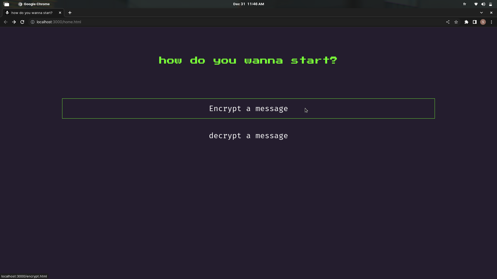
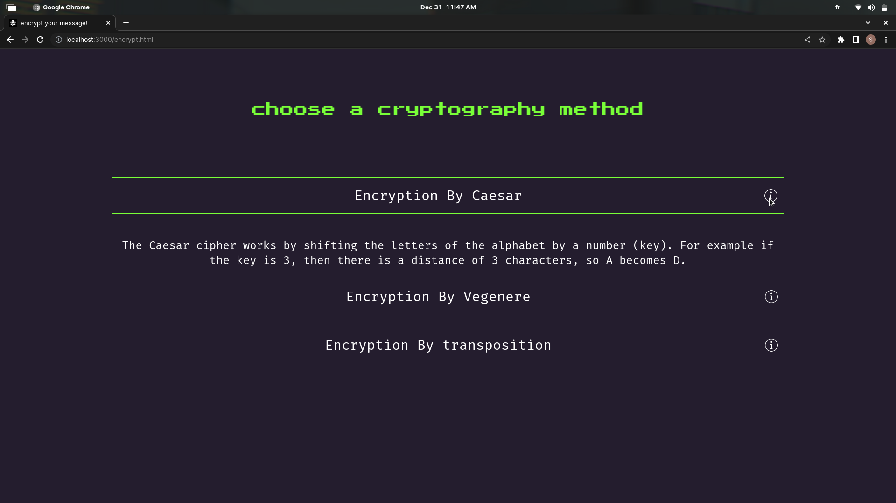
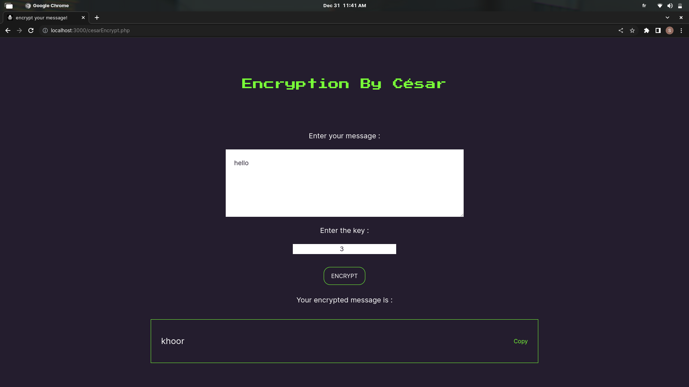
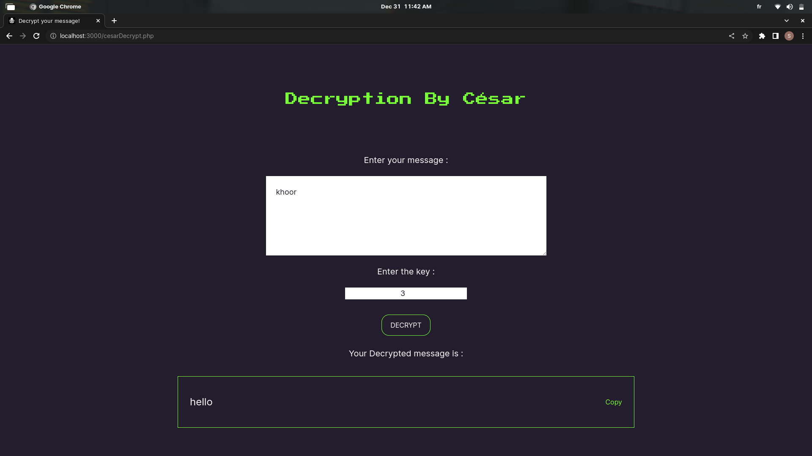

### this project helps you encrypt your messages or decrypt them using ciphers like Caesar , vigenère and The transposition technique .
 

## 📌 About The Project
---

### 📷 Screenshots
 

#### Home page 

#### I included a brief description of each method

#### encryption with Caesar cipher 

#### decryption with Caesar cipher 

## 🔧 Built With
---
 

* 
* 

 

## ❗ Prerequisites
---
 

* Apache2
* PHP

 

## 🤝 Contact
---
 

Ayouch Soumiya - ayouch.somaya@gmail.com

Project Link: [https://github.com/soumiya59/Cryptography-website](https://github.com/soumiya59/Cryptography-website)